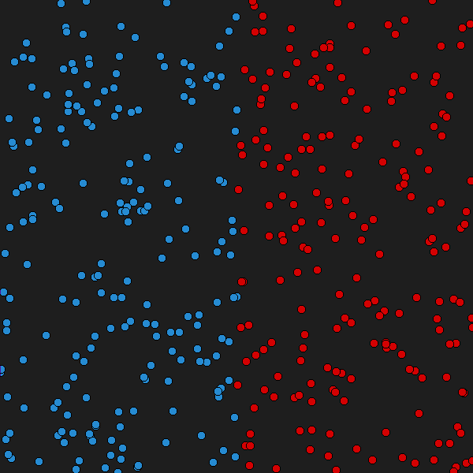
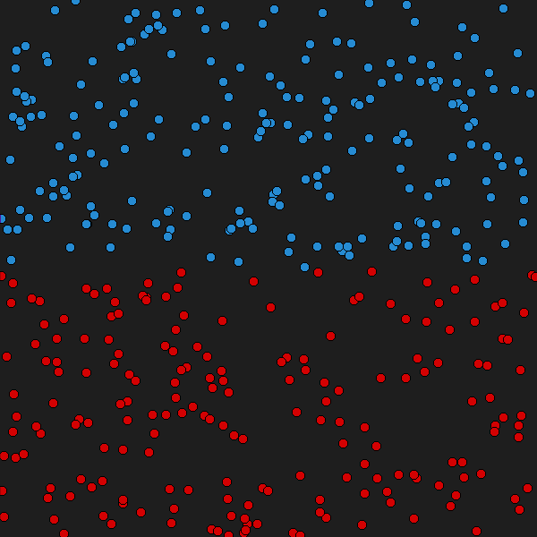
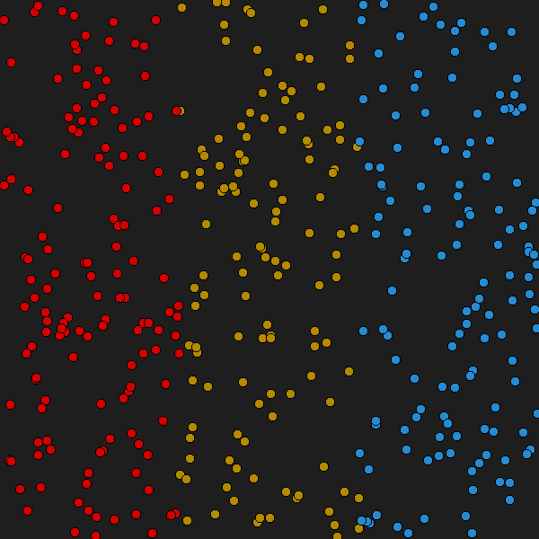
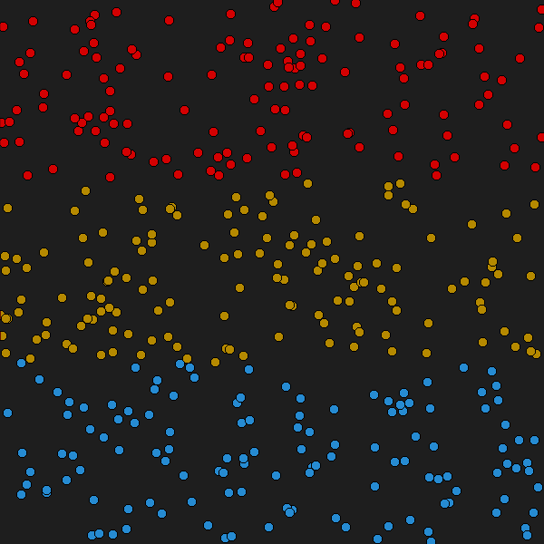
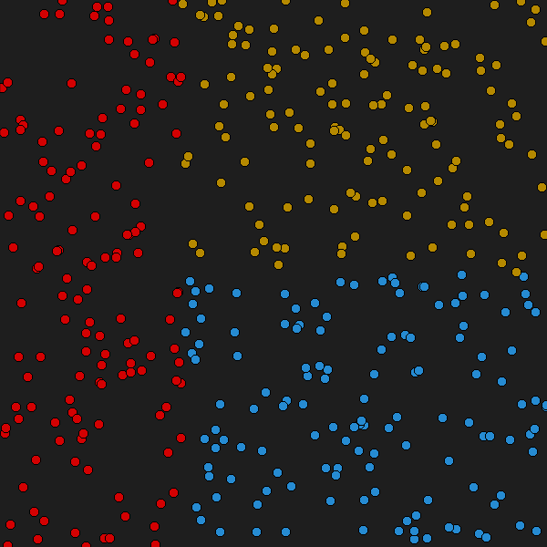
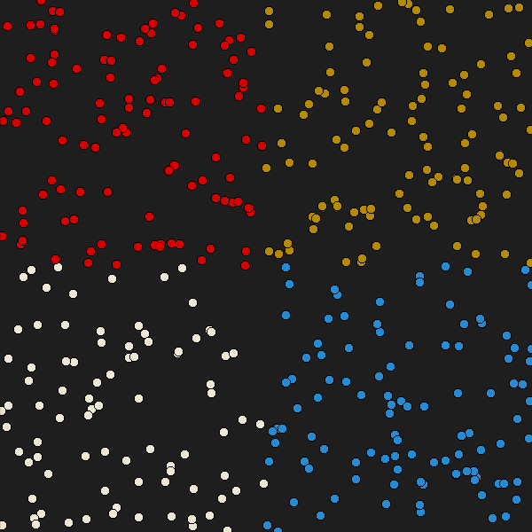
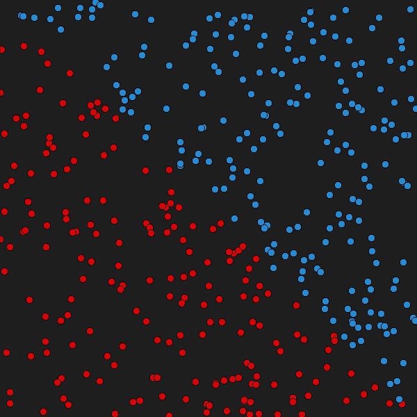
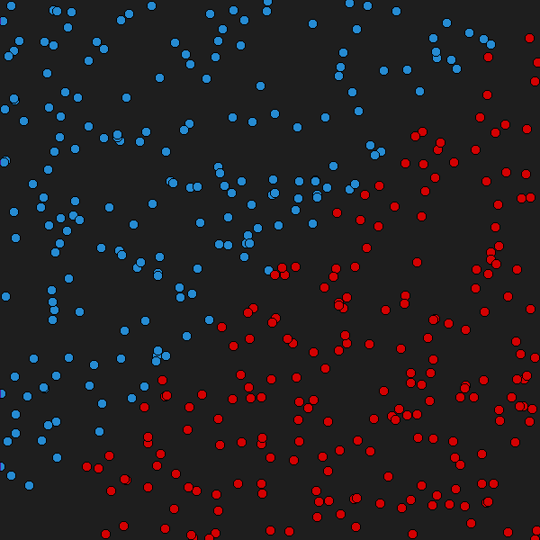
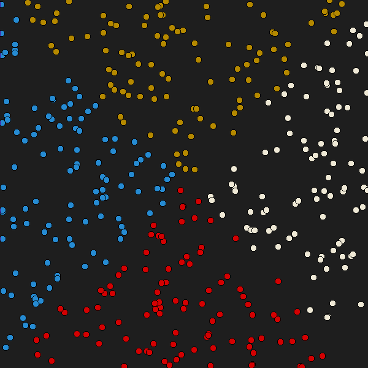
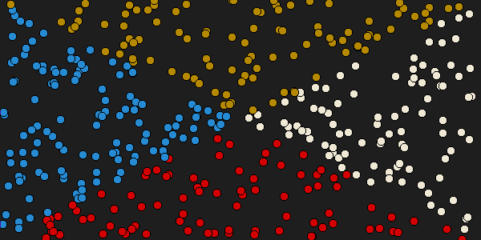

# Bandeiras
Nessa atividade você vai gerar imagens com varios padroes de bandeiras diferentes
partindo do exemplo:
## Rascunho

```c
create(largura, altura, "exemplo1");
  
    for(int i=0; i < 400; i++){


        int x = rand()%largura;//Cria uma posição de x aleatoria
        int y = rand()%altura;//Cria uma posição de y aleatoria

        if(x>largura/2){//Aqui temos um if: caso o x seja maior que a metade da largura, ele será pintado de vermelho
        fill("red");
        }else{
        fill("blue");//Se não, será pintado de azul
        }
        circle(x, y, 20);


    }
save();
destroy();
```

## Questão 1 - Leste Oeste



## Questão 2 - Norte Sul


## Questão 3 - Leste Meio Oeste


## Questão 4 - Norte Meio Sul


## Questão 5 - Leste Norte Sul


## Questão 6 - Quadrantes


## Questão 7 - Diagonal


## Questão 8 - Contradiagonal


## Questão 9 - X


## Questão 10 - X não quadrado

