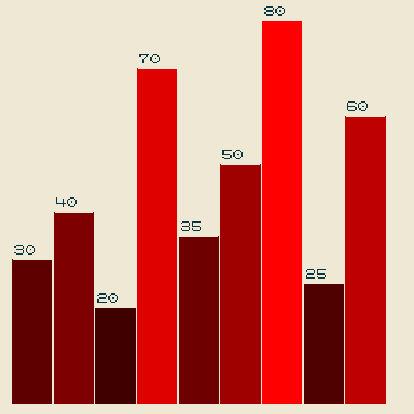

# XpaintAtividades

## Questao 1 - Grafico
Faça um programa que recebe um vetor e faz um gráfico de barras a partir dele, as cores das barras vão de claro a escuro de maneira decrescente.

Imagem de referência:

