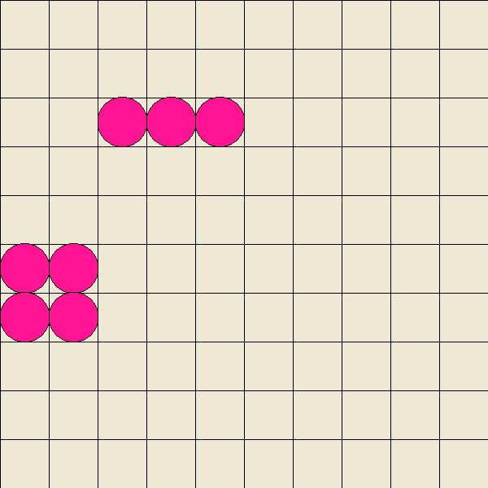

# XpaintAtividades

## Questao 1 - Jogo da Vida
Faça um programa que recria o jogo da vida, ele consiste numa matriz de células que beseado em algumas regras matemáticas podem sobreviver, morrer ou se multiplicar.

Regras:
- Cada célula com menos de dois vizinhos morre de de solidão
- Cada cécula com mais de três vizinhos morre de superpopulação
- Cada célula exatamente três ou dois vizinhos sobrevive
- Cada célula morta com exatamente três vizinhos se torna viva

Imagem de referência:

