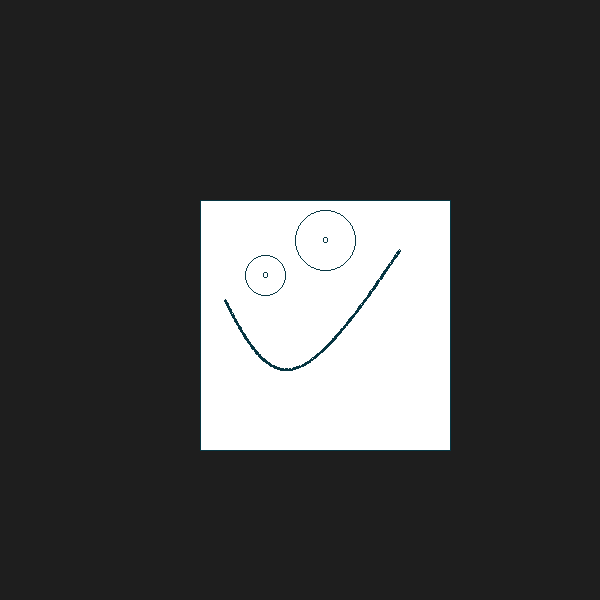

# XpaintAtividades

## Questao 1 - Ratinho
Faça um programa que crie um desenho que pode ser redimencionado para qualquer lugar com base em uma posição x ou y
Entradas - O usuario vai poder colocar a posicao x, y e a largura da figura

Imagem de referência:

